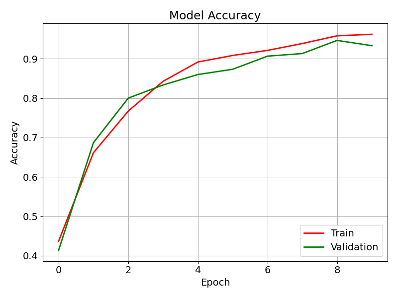
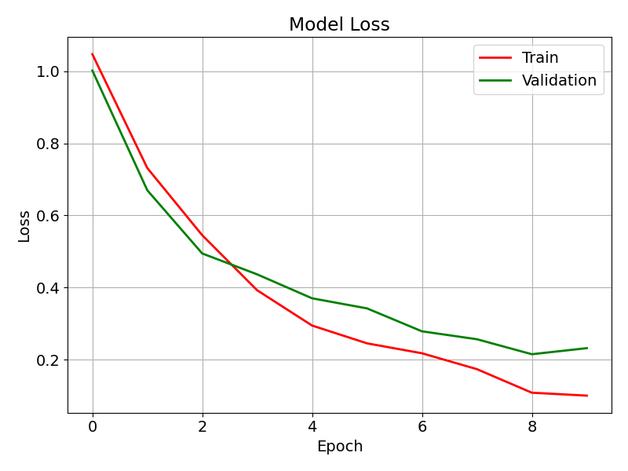
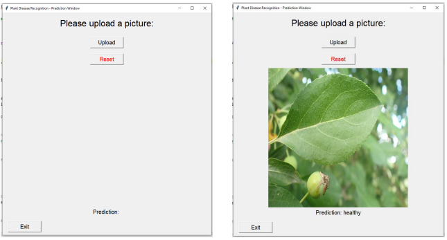
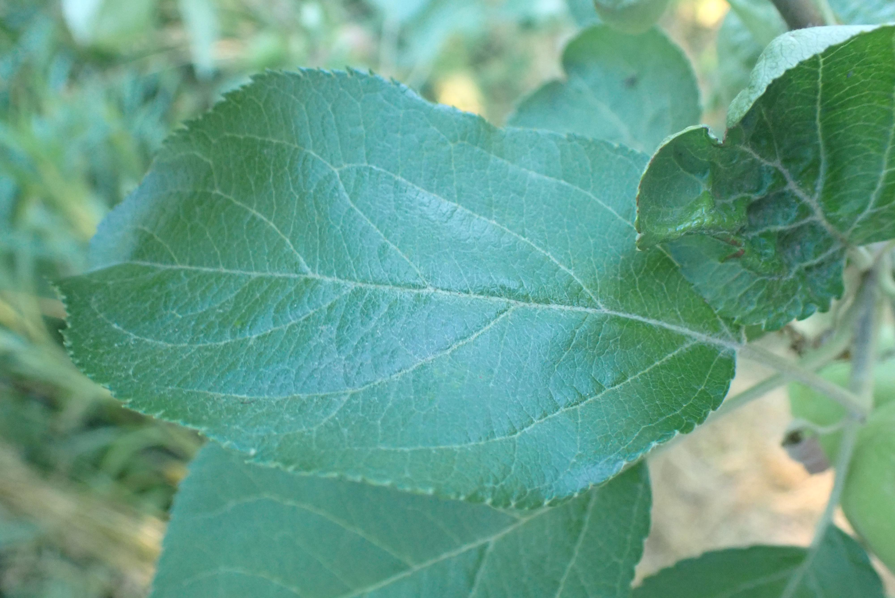
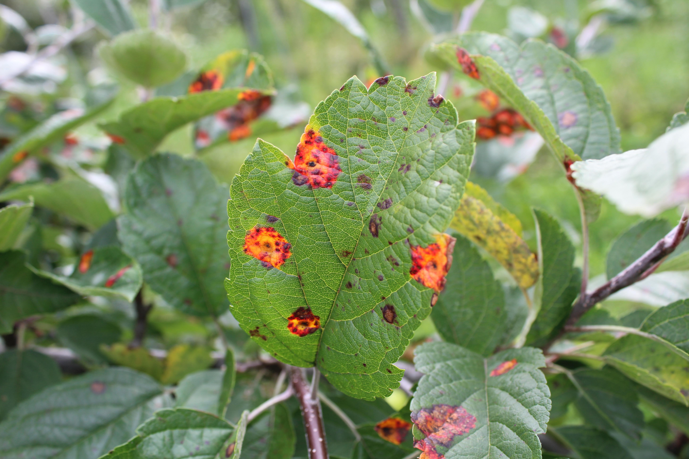

# Plant-Disease-Detection

This project is a Plant Disease Recognition system using a Convolutional Neural Network (CNN). It classifies plant leaves into three categories:  
✅ Healthy  
⚠️ Powdery Mildew  
❌ Rust Disease  

The model is trained using TensorFlow and Keras and includes a GUI for easy image classification.  

This project was completed in 2023 during a high school machine learning class.

## 🚀 Features
- 📸 Image Classification: Upload a leaf image to detect its health status.  
- 🎭 Deep Learning Model: A trained CNN model to classify plant diseases.  
- 📊 Accuracy Visualization: Automatically displays plots of training and validation accuracy/loss after model training.   
- 🖼 Image Preprocessing: Automatic resizing and augmentation.  
- 🖥 User-Friendly GUI: Simple interface for uploading and classifying images.  

## 📂 Dataset
The dataset contains images of plant leaves categorized into three classes:

1. Healthy 🌱  
2. Powdery Mildew 🍂  
3. Rust Disease 🍁  

Images are split into Train and Test sets for model training.

## 🛠 Technologies Used
1. Python 🐍  
2. TensorFlow & Keras 🤖  
3. Pillow (PIL) & OpenCV 🖼  
4. Matplotlib & NumPy 📊  
5. Tkinter 🎛 (for GUI)  

## Model Accuracy and Loss

Here are the accuracy and loss graphs from the model training:

  
  

## 🖥 User Interface

## 🌿 Example Images

### Healthy Leaf 🌱

### Powdery Mildew 🍂

### Rust Disease 🍁

